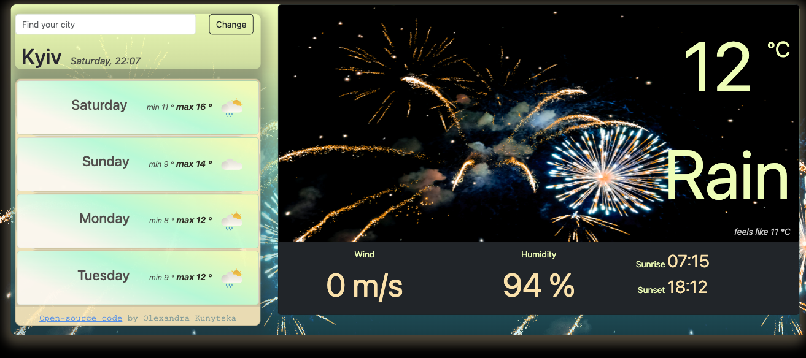
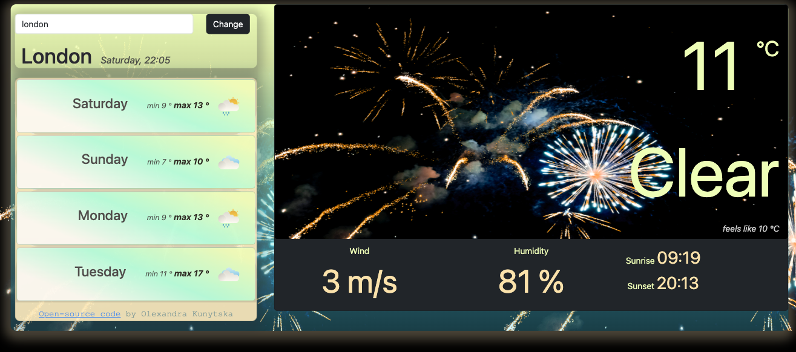

# Weather App

[Live Demo](https://vanilla-weather-app-rust.vercel.app/)

This is a **weather application** built using **HTML, CSS, JavaScript**, and **Bootstrap**. The app allows users to input the name of a city to get real-time weather updates, including the forecast for the current day and the upcoming week. The weather data is provided by **open APIs** such as **OpenWeatherMap** and **SheCodes Weather API**, making it possible to display up-to-date weather information dynamically.

## Features

- **Real-time weather updates**: Shows the current temperature, weather description, and "feels like" temperature.
- **7-day forecast**: Displays the weather forecast for the upcoming week.
- **Sunrise and sunset times**: Provides the exact times for sunrise and sunset for the selected city.
- **Wind speed and humidity**: Shows wind speed (m/s) and humidity percentage.
- **Responsive design**: Optimized for both desktop and mobile views.

## Technologies Used

- **HTML5**: Provides the structure of the app.
- **CSS3 & Bootstrap**: Used for styling and layout responsiveness.
- **JavaScript (ES6)**: Handles the logic for fetching and displaying weather data.
- **Axios**: Facilitates making HTTP requests to the weather APIs.
- **OpenWeatherMap API & SheCodes Weather API**: Provides real-time weather and forecast data.

## Usage of Open APIs

- **OpenWeatherMap API**: Used to retrieve the current weather information such as temperature, weather conditions, wind speed, and humidity based on the user's input (city name).
- **SheCodes Weather API**: Used to fetch the 7-day weather forecast data, including minimum and maximum temperatures, and weather icons for each day of the week.

## How to Use

1. Input the name of a city in the search bar.
2. Click the "Change" button or press Enter to view the weather data for the selected city.
3. The app will display current weather conditions, including temperature, "feels like" temperature, and wind speed, as well as a 7-day forecast.

  
  

